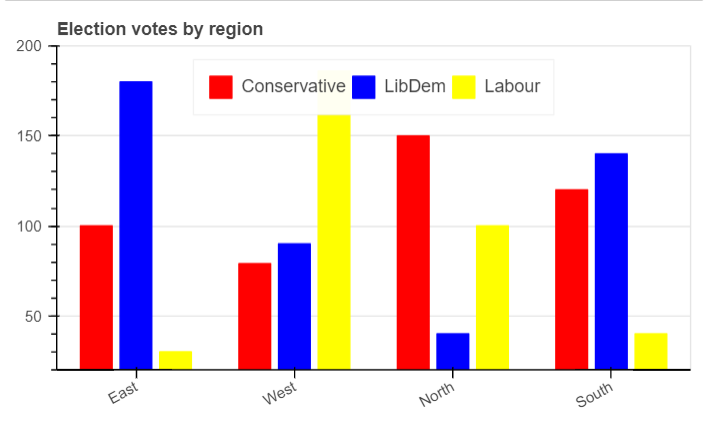

# Fundamentals of Data Visualisation using Bokeh.

### [Book](https://clauswilke.com/dataviz/index.html) by Claus O. Wilke

## Introduction.

#### What is Bokeh?

[Bokeh](https://docs.bokeh.org/en/latest/index.html) is a Python library for creating interactive visualizations for modern web browsers. It helps you build beautiful graphics, ranging from simple plots to complex dashboards with streaming datasets. With Bokeh, you can create JavaScript-powered visualizations without writing any JavaScript yourself.

In this blog post, I will demonstrating how to create some common visualisations with Bokeh using Jupyter notebook. In order to follow, and possibly recreate these plots, you should have [Python](https://www.python.org) installed on your local computer and also jupyter notebook, which can be gotten via the anaconda distribution [here](https://www.anaconda.org)

### Directory of visualisations.

There are two ways in which you can display the visualisations created using Bokeh. By default, Bokeh displays the plots on the web browser but you can display your plots inline on your jupyter notebook by importing and running `output_notebook` before showing the plots.

    from bokeh.io import output_notebook
    
    # run output_notebook to plot inline
    `output_notebook()`

    
 **Bar Charts**

You can create vertical or horizontal bar charts with Bokeh as follows:

    # Import the relevant libraries
    from bokeh.plotting import figure, show
    from bokeh.layouts import row

    # Sample data
    names = ['Mary', 'Peter', 'James', 'Mercy']
    ages = [20, 23, 15, 27]
    
    # plot a vertical bar
    p1 = figure(
        x_range=names,
        height=300,
        title="Age of siblings",
        x_axis_label = "Names",
        y_axis_label = "Ages"
        )
    p1.vbar(x = names, top= ages, width=0.5, color = "green")

    # plot a horizontal bar
    p2 = figure(
        y_range = names,
        x_range = (10, 30),
        width=300,
        height=300,
        title="Age of siblings",
        x_axis_label = "Names",
        y_axis_label = "Ages",
        toolbar_location = None # option to remove the plot toolbar
        )
    p2.hbar(y = names,
            left = 10,
            right = ages,
            height = 0.5,
            color = "red")

    # specify y_range for the vertical plot
    p1.y_range.start = 10

    # display both plots in the same row
    show(row(children = [p1, p2], 
             sizing_mode = "stretch_width"))

You can also create grouped bar charts if you have two or more sets of categories you want to show their amounts.

    #import libraries
    from bokeh.models import ColumnDataSource
    from bokeh.transform import dodge

    # sample data
    parties = ["Conservative", "LibDem", "Labour"]
    regions = ["East", "West", "North", "South"]
    votes = {"region": regions,
            "Conservative": [100, 79, 150, 120],
            "LibDem": [180, 90, 40, 140],
            "Labour": [30, 186, 100, 40],}

    # create data source
    source = ColumnDataSource(data=votes)

    # Plot charts
    p = figure(title="Election votes by region",
            x_range=regions,
            height=300,
            toolbar_location = None,
            sizing_mode="stretch_width"
            )
    p.vbar(x=dodge("region", -0.25, range=p.x_range),
        top="Conservative",
        width=0.2,
        source=source,
        legend_label="Conservative",
        color="red")
    p.vbar(x=dodge("region", 0.0, range=p.x_range),
        top="LibDem",
        width=0.2,
        source=source,
        legend_label="LibDem",
        color="blue")
    p.vbar(x=dodge("region", 0.25, range=p.x_range),
        top="Labour",
        width=0.2,
        source=source,
        legend_label="Labour",
        color="yellow")

    p.y_range.start = 20
    p.y_range.end = 200
    p.xaxis.major_label_orientation = 0.5
    p.xgrid.grid_line_color = None
    p.legend.location = "top_center"
    p.legend.orientation = "horizontal"

    show(p)

In the above plot, `ColumnDataSource` is used to store the data for the election results. The ColumnDataSource (CDS) is the core of most Bokeh plots. It provides the data to the glyphs of your plot. For more information about CDS, see [here](https://docs.bokeh.org/en/latest/docs/user_guide/basic/data.html#ug-basic-data-cds).

`dodge()` is a function in Bokeh that shifts the bars horizontally so that they don't overlap. It takes three parameters: the name of the column to dodge, the amount to shift the bar (in this case, -0.25, 0.0, and 0.25), and the range of the x-axis.

`legend`, a  property of a Bokeh figure that allows you to add a legend to the plot is used to add and customise the legend of the plot.

Always remember to run `output_notebook()` in order to display your plots inline if you are using jupyter notebook.