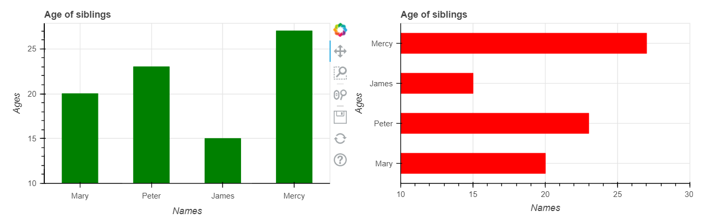

# Fundamentals of Data Visualisation using Bokeh.

### [Book](https://clauswilke.com/dataviz/index.html) by Claus O. Wilke

## Introduction.

#### What is Bokeh?

[Bokeh](https://docs.bokeh.org/en/latest/index.html) is a Python library for creating interactive visualizations for modern web browsers. It helps you build beautiful graphics, ranging from simple plots to complex dashboards with streaming datasets. With Bokeh, you can create JavaScript-powered visualizations without writing any JavaScript yourself.

In this blog post, I will demonstrating how to create some common visualisations with Bokeh using Jupyter notebook. In order to follow, and possibly recreate these plots, you should have [Python](www.python.org) installed on your local computer and also jupyter notebook, which can be gotten via the anaconda distribution [here](www.anaconda.org)

### Directory of visualisations.

There are two ways in which you can display the visualisations created using Bokeh. By default, Bokeh displays the plots on the web browser but you can display your plots inline on your jupyter notebook by importing and running `output_notebook` before showing the plots.

    from bokeh.io import output_notebook
    
    # run output_notebook to plot inline
    `output_notebook()`

    
    # Import the relevant libraries
    from bokeh.plotting import figure, show
    from bokeh.layouts import row

    # Sample data
    names = ['Mary', 'Peter', 'James', 'Mercy']
    ages = [20, 23, 15, 27]
    
    # Assign names to x-axis by passing the list as the x-range argument to `figure()`

    # plot a vertical bar
    p1 = figure(
        x_range=names,
        height=300,
        title="Age of siblings",
        x_axis_label = "Names",
        y_axis_label = "Ages"
        )
    p1.vbar(x = names, top= ages, width=0.5, color = "green")

    # plot a horizontal bar
    p2 = figure(
        y_range = names,
        x_range = (10, 30),
        width=300,
        height=300,
        title="Age of siblings",
        x_axis_label = "Names",
        y_axis_label = "Ages",
        toolbar_location = None # option to remove the plot toolbar
        )
    p2.hbar(y = names,
            left = 10,
            right = ages,
            height = 0.5,
            color = "red")

    # specify y_range for the vertical plot
    p1.y_range.start = 10

    # display both plots in the same row
    show(row(children = [p1, p2], 
             sizing_mode = "stretch_width"))

 

