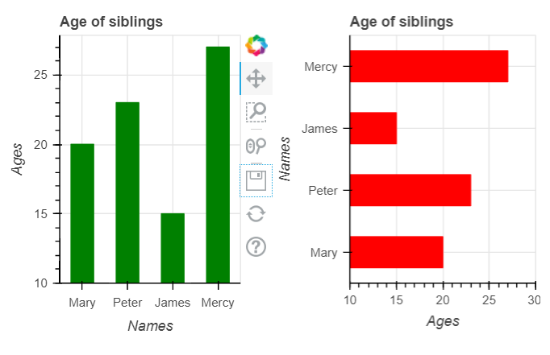

# Fundamentals of Data Visualisation (using Bokeh).

### [Book](https://clauswilke.com/dataviz/index.html) by Claus O. Wilke as reference.

## Introduction.

#### What is Bokeh?

[Bokeh](https://docs.bokeh.org/en/latest/index.html) is a Python library for creating interactive visualizations for modern web browsers. It helps you build beautiful graphics, ranging from simple plots to complex dashboards with streaming datasets. With Bokeh, you can create JavaScript-powered visualizations without writing any JavaScript yourself.

In this blog post, I will be demonstrating how to create some common visualisations found in the referenced book with Bokeh using Jupyter notebook. In order to follow, and possibly recreate these plots, you should have [Python](https://www.python.org) installed on your local computer and also jupyter notebook, which can be gotten via the anaconda distribution [here](https://www.anaconda.org)

### **Directory of visualisations.**

There are two ways in which you can display the visualisations created using Bokeh. By default, Bokeh displays the plots on the web browser but you can display your plots inline on your jupyter notebook by importing and running `output_notebook` before showing the plots.

    from bokeh.io import output_notebook
    
    # run output_notebook to plot inline
    `output_notebook()`

    
 ### **Bar Charts**

Bar charts are tools used to visualise amounts. You can create *vertical* or *horizontal* bar charts with Bokeh as follows:

    # Import the relevant libraries
    from bokeh.plotting import figure, show
    from bokeh.layouts import row

    # sample data
    names = ["Mary", "Peter", "James", "Mercy"]
    ages = [20, 23, 15, 27]

    # plot a vertical bar
    p1 = figure(
        x_range=names,
        height=300,
        title="Age of siblings",
        x_axis_label="Names",
        y_axis_label="Ages"
        )
    p1.vbar(x=names,
            top=ages,
            width=0.5,
            color="green")

    # plot a horizontal bar
    p2 = figure(
        y_range=names,
        x_range=(10, 30),
        width=300,
        height=300,
        title="Age of siblings",
        x_axis_label="Names",
        y_axis_label="Ages",
        toolbar_location=None # option to remove the plot toolbar
        )
    p2.hbar(y=names,
            left=10,
            right=ages,
            height=0.5,
            color="red")

    # specify y_range for the vertical plot
    p1.y_range.start = 10

    # display both plots in the same row
    show(row(children=[p1, p2], 
            sizing_mode="stretch_width"))

You can also create *grouped* bar charts if you have two or more sets of categories you want to compare their amounts side by side:

    #import libraries
    from bokeh.models import ColumnDataSource
    from bokeh.transform import dodge

    # sample data
    parties = ["Conservative", "LibDem", "Labour"]
    regions = ["East", "West", "North", "South"]
    votes = {"region": regions,
            "Conservative": [100, 79, 150, 120],
            "LibDem": [180, 90, 40, 140],
            "Labour": [30, 186, 100, 40],}

    # create data source
    source = ColumnDataSource(data=votes)

    # Plot charts
    p = figure(title="Election votes by region",
            x_range=regions,
            height=300,
            toolbar_location=None,
            sizing_mode="stretch_width"
            )
    p.vbar(x=dodge("region", -0.25, range=p.x_range),
        top="Conservative",
        width=0.2,
        source=source,
        legend_label="Conservative",
        color="red")
    p.vbar(x=dodge("region", 0.0, range=p.x_range),
        top="LibDem",
        width=0.2,
        source=source,
        legend_label="LibDem",
        color="blue")
    p.vbar(x=dodge("region", 0.25, range=p.x_range),
        top="Labour",
        width=0.2,
        source=source,
        legend_label="Labour",
        color="yellow")

    p.y_range.start = 20
    p.y_range.end = 200
    p.xaxis.major_label_orientation = 0.5
    p.xgrid.grid_line_color = None
    p.legend.location = "top_center"
    p.legend.orientation = "horizontal"

    show(p)

In the above plot, `ColumnDataSource` is used to store the data for the election results. The ColumnDataSource (CDS) is the core of most Bokeh plots. It provides the data to the glyphs of your plot. For more information about CDS, see [here](https://docs.bokeh.org/en/latest/docs/user_guide/basic/data.html#ug-basic-data-cds).

`dodge()` is a function in Bokeh that shifts the bars horizontally so that they don't overlap. It takes three parameters: the name of the column to dodge, the amount to shift the bar (in this case, -0.25, 0.0, and 0.25), and the range of the x-axis.

`legend`, a  property of a Bokeh figure that allows you to add a legend to the plot. It is used to add and customise the legend of the plot.

Always remember to run `output_notebook()` in order to display your plots inline if you are using jupyter notebook.

### **Density Plots**

***Histograms*** are usually the most common method of visualising density distributions. Consider the following data set:

    # import libraries
    import pandas as pd
    ​
    data = {
    "age_range":["0-5",
                 "6-10",
                 "11-15",
                 "16-20",
                 "21-25",
                 "26-30",
                 "31-35",
                 "36-40",
                 "41-45",
                 "46-50",
                 "51-55",
                 "56-60"],
    "count":[36,19,18,99,139,121,76,74,54,50,26,22],
       }

    age_interval = list(range(0,61,5))

We can visualise the age distribution in this data set using a histogram as follows:

    from bokeh.plotting import figure, show

    p = figure(title="Age Distribution",
            sizing_mode="stretch_width",
            width=100,
            height=400,
            toolbar_location=None,
            )
    p.quad(left=age_interval[:-1],
       right=age_interval[1:],
       bottom=0,
       top=data["count"],
       color="skyblue",
       line_color="white",
       line_width=2,
       alpha=0.9)

    p.xaxis.axis_label = "Age range"
    p.yaxis.axis_label = "Count"

    show(p)

​
The `quad()` method is a Bokeh glyph method used to create a quadrilateral shape with four vertices. It takes in four lists of coordinates, which correspond to the x and y coordinates of the four vertices, and optional parameters to customize the appearance of the glyph.

Here are the parameters for the `quad()` method:

*left* (float): The x-coordinates of the left edges of the quads.

*right* (float): The x-coordinates of the right edges of the quads.

*bottom* (float): The y-coordinates of the bottom edges of the quads.

*top* (float): The y-coordinates of the top edges of the quads.

These parameters can be lists or arrays of values that specify the coordinates of each quad. In addition to these required parameters, the quad() method also accepts the following optional parameters:

*color* (str): The color of the quad outlines.

*alpha* (float): The transparency of the quad outlines and fills.

*line_width* (float): The width of the quad outlines.

*line_color* (str): The color of the quad outlines.

*line_alpha* (float): The transparency of the quad outlines.

*fill_color* (str): The fill color of the quads.

*fill_alpha* (float): The transparency of the quad fills.

#### **Visualising Proportions**

- ***Pie Charts*** are a common way of visualising proportions. It helps to quickly and easily understand how a given part is compared to a whole.

Consider the following data sample:

    party = ["CDU", "SPD", "FDP"]
    num_seats = [243, 214, 39]

You can make a Pie chart showing the proportion of the total seats each party holds as follows:

    from bokeh.plotting import figure, show
    from math import pi
    from bokeh.transform import cumsum
    import pandas as pd

    # create a pandas dataframe with the data sample
    df = pd.DataFrame({"party": party,
                    "seats": num_seats})

    df["angle"] = df["seats"]/df["seats"].sum()*2*pi
    df["color"] = ["black", "red", "yellow"]

    p = figure(title="Party seats by proportion",
            height=300,
            toolbar_location=None,
            tools="hover",
            tooltips="@party: @seats",
            x_range=(0, 1),
            sizing_mode="stretch_width")

    p.wedge(x=0.5,
            y=0.5,
            radius=0.25,
            start_angle=cumsum("angle", include_zero=True),
            end_angle=cumsum("angle"),
            line_color="white",
            legend_field="party",
            color="color",
            source=df)

    p.axis.axis_label = None
    p.axis.visible = False
    p.grid.grid_line_color = None

    show(p)

The `angle` column added to the pandas dataframe contains the angle of each wedge in radians, which is proportional to the number of seats held by each party.

**The `wedge()` method** is used to draw each wedge in the plot. It takes the following arguments:

*x* (float): specifies the midpoint position of the circle in the x axis.

*y* (float): specifies the midpoint position of the circle in the y axis.

*radius* (float): takes the size of the circle radius.

*start and end angle* (float): computed using the cumsum function, which calculates the cumulative sum of the angle column of the DataFrame. This ensures that each wedge starts where the previous one left off.

Other optional parameters can also be included like color and legend fields.

The `color` argument specifies the color of each wedge based on the color column of the DataFrame, and the `legend_field` argument adds a legend to the plot showing the name of each party.

Finally, the code also sets some additional plot properties using the axis and grid properties of the plot.

- ***Stacked bars*** are another method of visualising proportions, especially if the data is being compared across different times.

Consider the following [data](https://data.ipu.org/content/rwanda?chamber_id=13513) about women participation in the Rwandan parliament over the years:

    import pandas as pd

    data = {
        "Year": ["1981","1983","1988","1994","2003","2008","2011","2013","2018"],
        "%women": [6.3,12.9,17.1,4.3,48.8,56.3,38.5,56.3,61.3]}

    df = pd.DataFrame(data)
    df["%men"] = [100-x for x in df["%women"]]
             
You can create a stacked bar chart showing how the proportions have been changing over the years as follows:

    from bokeh.plotting import figure, show 
    from bokeh.models import Span

    p = figure(title="Proportion of women and men in parliament",
            height=300,
            toolbar_location=None,
            x_range=df.Year,
            y_range=(0,100),
            sizing_mode="stretch_width")

    p.vbar_stack(["%men", "%women"],
                x="Year",
                width=0.95,
                source=df,
                color=["skyblue","pink"],
                legend_label=["men", "women"])

    p.y_range.start = 0
    p.xgrid.grid_line_color = None
    p.xaxis.axis_label = "Year"
    p.yaxis.axis_label = "Percentage"
    p.legend.location = "top_right"
    p.legend.orientation = "vertical"
    p.legend.background_fill_alpha = 0.3

    # Add horizontal line
    line = Span(location=50,
                dimension="width",
                line_color="black",
                line_width=1.5)

    p.add_layout(line)

    show(p)

The `vbar_stack` method plots the data ontop of each other and a casual glance at the plot reveals how the percentage of women in parliament has been increasing over the years with the percentage crossing 50% around 2003.

A horizontal line is also drawn to clearly show the threshold where the participation got to 50%.

### Visualising time series

*Line plots* and *Scatter plots* are a good way of visualising how things change over time. Take the previous data sample for example: You can plot a line graph and scatter plot to depict how the trend in women participation has evolved over the years.

    import pandas as pd
    from bokeh.plotting import figure, show

    p = figure(title="Women participation over the years",
            plot_height=300,
            sizing_mode="stretch_both",
            tools="hover",
            tooltips="@Year: @{%women}%",
            toolbar_location=None)

    p.line(x="Year",
        y="%women",
        source=df,
        line_width=2,
        color="skyblue")

    p.scatter(x="Year",
            y="%women",
            source=df,
            size=5,
            fill_color="grey")

    p.xaxis.axis_label = "Year"
    p.yaxis.axis_label = "Percentage"

    show(p)

The `scatter` method is used to plot the percentage points against the year while the `line` method is used to join the plot points together. The `hover` tool is used to add interactive options on the scatter points to show the actual values.