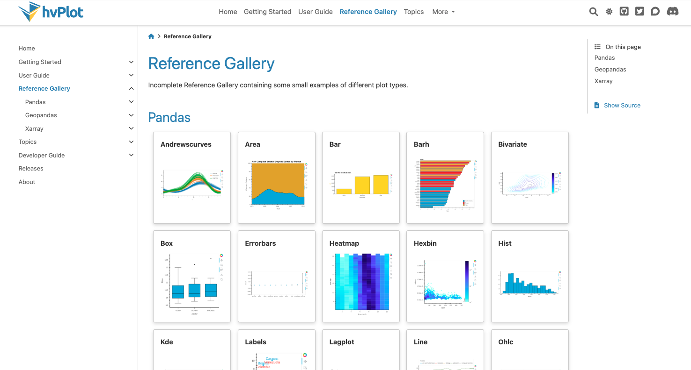
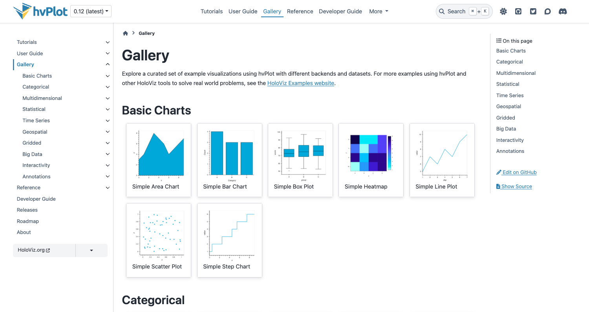
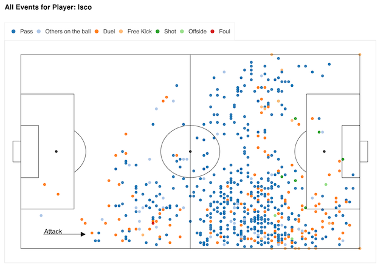
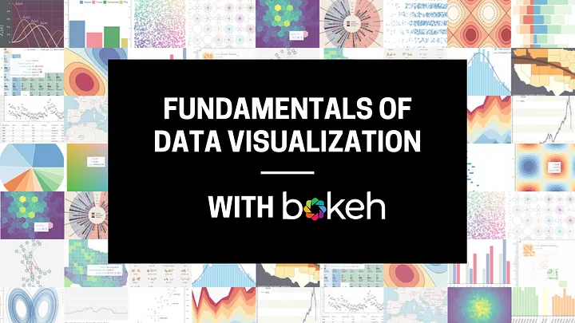

A selection of work across data analysis, visualization, open-source contribution, and software development.

---

### HoloViz LLM Skills
`Python` `Open Source` `AI Tooling`

Developed reusable agent skills and an evaluation framework to improve the quality of
LLM-generated code for the HoloViz ecosystem, funded by a NumFOCUS Small Development Grant.
Benchmarked common failure modes including hallucinated APIs, outdated syntax, and missing imports.

[GitHub →](https://github.com/holoviz-topics/holoviz-skills)
[Project Website →](https://holoviz-dev.github.io/holoviz-skills/)

[Mid-project Blog Post](https://blog.holoviz.org/posts/holoviz_llm/)

---

### hvPlot Documentation Website
`Python` `Open Source` `Docs`

Spearheaded a complete redesign of the hvPlot documentation website, implementing the [Diátaxis framework](https://diataxis.fr) to restructure content around user needs — funded by a NumFOCUS Small Development Grant.

Built four new content pillars: 

**Tutorials** for learning-oriented flow, 

**How-To Guides** for problem-solving, 

**Explanation** for conceptual depth, and 

A comprehensive **API Reference** auto-generated from source docstrings.

Integrated the new [`hvsampledata`](https://github.com/holoviz/hvsampledata) package to provide reproducible, real-world datasets across all examples.

The overhaul reduced onboarding friction and unified the documentation experience across the HoloViz ecosystem.

 
Old Gallery

 
New Gallery

[GitHub Project Board →](https://github.com/orgs/holoviz/projects/23)

[Release Blog Post](https://blog.holoviz.org/posts/hvplot_release_0.12/#major-expansion-and-improvement-of-the-reference-documentation)

[View full website evolution on Wayback Machine](https://web.archive.org/web/20230927081921/https://hvplot.holoviz.org/index.html)

---

### HoloViz Website Examples
`Python` `Open Source` `Docs`

 
World Cup example dashboard

Revitalized the HoloViz Examples Gallery — the primary showcase for the entire HoloViz ecosystem — by modernizing 10 examples to current APIs and introducing new categories that demonstrate cross-library integration (Panel + hvPlot + HoloViews).

Updated nine legacy examples and authored one brand-new end-to-end World Cup dashboard example, ensuring every gallery entry is runnable, documented, and demonstrates best practices. This work directly supports user onboarding and library adoption by providing production-ready reference implementations.

[GitHub →](https://github.com/holoviz-topics/examples/pulls?q=sort%3Aupdated-desc+is%3Apr+is%3Amerged+label%3A%22NF+SDG%22)

[Example Website →](https://holoviz-dev.github.io/examples/gallery/index.html)

---

### Fundamentals of Data Visualization (Bokeh)
`Python` `Bokeh` `Data Visualization`

Recreated complex visualizations from Claus O. Wilke's *Fundamentals of Data Visualization*
using the Bokeh library during an Outreachy internship. Each visualization was documented
with a technical blog post covering the approach and workflow.

[GitHub →](https://github.com/bokeh/dataviz-fundamentals)

[Project Website →](https://bokeh.github.io/dataviz-fundamentals/)
